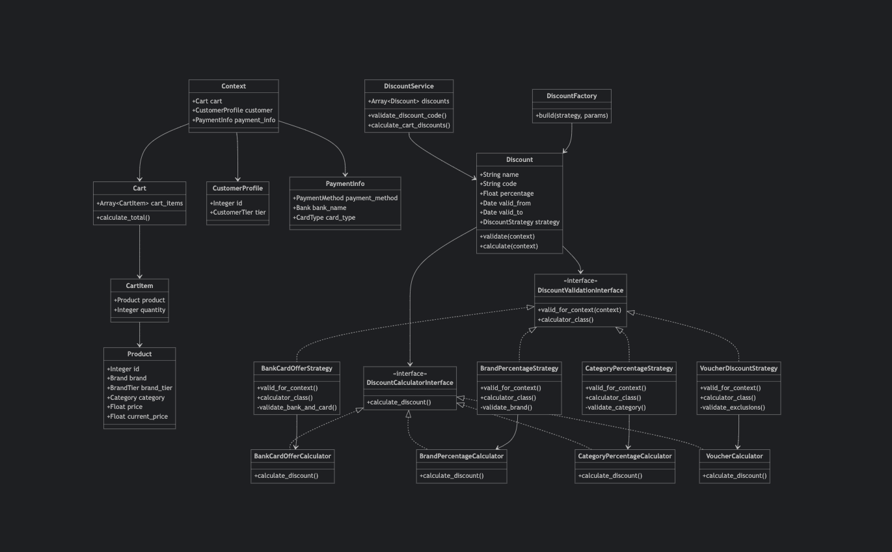

# Discounting App

A Ruby application that implements a flexible and extensible discounting system for an e-commerce platform. The system supports various types of discounts including brand-specific discounts, category-based discounts, bank card offers, and voucher-based discounts.

## Getting Started

### Prerequisites

- Ruby 2.7 or higher
- Bundler gem

### Installation

1. Clone the repository:
```bash
git clone <repository-url>
cd discounting_app
```

2. Install dependencies:
```bash
bundle install
```

### Running the Application

1. Run the main application to see example discount calculations:
```bash
ruby main.rb
```

2. Run the test cases:
```bash
ruby data/test_runner.rb
```

## Project Structure

```
discounting_app/
├── app/
│   ├── enums/              # Enumeration classes for various types
│   ├── models/             # Core domain models
│   │   └── discount_strategies/  # Strategy implementations
│   ├── services/           # Business logic services
│   │   ├── discount_calculators/ # Discount calculation implementations
│       └── interfaces/     # Strategy pattern interfaces
├── data/                   # Test data and test cases
├── config/                 # Application configuration
├── lib/                    # Library code and tasks
└── spec/                   # Test specifications
```

## Models

### Core Models

1. **Context**
   - Central class that holds cart, customer, and payment information
   - Used to evaluate discount applicability

2. **Cart**
   - Contains collection of cart items
   - Handles total price calculations

3. **CartItem**
   - Represents a product and its quantity in the cart
   - Links products to cart

4. **Product**
   - Represents a product with its attributes
   - Includes brand, category, and pricing information

5. **CustomerProfile**
   - Customer information including tier (REGULAR, GOLD, PLATINUM)
   - Used for tier-based discount decisions

6. **PaymentInfo**
   - Payment method details
   - Includes bank and card information for bank offers

7. **Discount**
   - Represents a discount configuration
   - Includes validity period, conditions, and discount value


The application implements a dual-interface strategy pattern for handling discount calculations and validations:

### Interfaces

1. **DiscountCalculatorInterface**
   - Defines the contract for discount calculation
   - Method: `calculate_discount(context)`
   - Used by calculator classes to compute actual discount amounts
   - Ensures consistent discount calculation across different types

2. **DiscountValidationInterface**
   - Defines the contract for discount validation
   - Methods:
     - `valid_for_context?(context)`: Validates if discount can be applied
     - `calculator_class`: Returns the appropriate calculator class
   - Used by strategy classes to validate discount applicability
   - Ensures proper validation before discount application

### Concrete Strategies

1. **Bank Card Offer**
   - Strategy: `BankCardOfferStrategy`
     - Validates bank name and card type
     - Ensures correct payment method
   - Calculator: `BankCardOfferCalculator`
     - Calculates percentage discount for valid bank cards
     - Example: "10% off on ICICI Credit Cards"

2. **Brand Percentage**
   - Strategy: `BrandPercentageStrategy`
     - Validates product brand
     - Checks brand-specific conditions
   - Calculator: `BrandPercentageCalculator`
     - Applies brand-specific percentage discounts
     - Example: "40% off on PUMA products"

3. **Category Percentage**
   - Strategy: `CategoryPercentageStrategy`
     - Validates product category
     - Checks category-specific conditions
   - Calculator: `CategoryPercentageCalculator`
     - Implements category-based discounts
     - Example: "20% off on Footwear"

4. **Voucher**
   - Strategy: `VoucherDiscountStrategy`
     - Validates voucher code
     - Checks exclusions and conditions
   - Calculator: `VoucherCalculator`
     - Handles voucher-based discounts with exclusions
     - Example: "SUMMER50 for 50% off, excluding NIKE products"

### Factory

**DiscountFactory**
- Creates appropriate discount strategy instances
- Maps discount types to their implementations
- Ensures proper initialization of both strategy and calculator classes
- Maintains the relationship between strategies and their calculators

## Class Diagram

The system is organized in a layered architecture to maintain clear separation of concerns and minimize dependencies:

### Layer Organization

1. **Domain Models Layer**
   - Core business entities (Cart, Product, etc.)
   - Represents the fundamental data structures

2. **Discount Model Layer**
   - Central Discount class that ties together strategies and calculations
   - Manages discount validation and calculation

3. **Service Layer**
   - DiscountService for orchestrating discount operations
   - DiscountFactory for creating discount instances

4. **Interface Layer**
   - DiscountValidationInterface for validation contract
   - DiscountCalculatorInterface for calculation contract

5. **Strategy Layer**
   - Concrete implementations of validation strategies
   - Each strategy handles specific discount type validation

6. **Calculator Layer**
   - Concrete implementations of discount calculators
   - Each calculator handles specific discount computation



### Key Relationships

1. **Domain Model Dependencies**
   - Context aggregates Cart, CustomerProfile, and PaymentInfo
   - Cart contains CartItems, which reference Products

2. **Discount Flow**
   - DiscountService manages Discount instances
   - Each Discount uses both validation and calculation interfaces
   - Strategies implement validation and link to their calculators

3. **Strategy Pattern Implementation**
   - Clear separation between validation and calculation concerns
   - Factory creates appropriate strategy instances
   - Each strategy pairs with its corresponding calculator

This layered approach ensures:
- Clear separation of concerns
- Easy addition of new discount types
- Maintainable and testable code
- Minimal cross-layer dependencies

## Test Cases

The application includes comprehensive test cases located in the `data/` directory:

### Test Files

1. **test_cases.rb**
   - Contains 10 different test scenarios
   - Each test case includes:
     - Cart configuration
     - Customer profile
     - Payment information
     - Available discounts
     - Expected outcomes

2. **test_runner.rb**
   - Test execution engine
   - Runs all test cases
   - Provides detailed output including:
     - Cart contents
     - Applied discounts
     - Price calculations
     - Savings information

### Test Scenarios

1. Brand Discount Test
2. Category Discount Test
3. Bank Offer Test
4. Voucher Discount Test
5. Multiple Discounts Test
6. No Applicable Discounts Test
7. Premium Purchase Test
8. Mixed Brands Test
9. Single Premium Item Test
10. Bulk Purchase Test

Each test case is designed to validate different aspects of the discounting system, ensuring proper functionality across various scenarios and discount combinations.

## Improvements and Future Enhancements

### SKU-based Cart Implementation

The current implementation has some limitations in handling complex discount scenarios. Here's a proposed improvement:

#### Current Limitations
1. Cart items are product-quantity pairs
2. Cannot track individual units of a product
3. Difficult to implement unit-specific discounts
4. Limited support for quantity-based offers

#### Proposed Solution: SKU Model

SKU model where in each quantity of a product becomes a separate SKU item and CartItem contain a product and it's SKU's

#### Benefits of SKU Implementation

1. **Granular Unit Tracking**
   - Each product unit has a unique identifier
   - Enables unit-specific pricing and discounts

2. **Complex Discount Scenarios**
   - Buy X Get Y Free offers
   - Different discounts for different units
   - Manufacturing date-based pricing

4. **Enhanced Discount Rules**
   - "50% off on last month's manufacturing"
   - "Extra 10% off on bulk purchase (10+ units)"

This enhancement would make the system more flexible and capable of handling complex real-world discount scenarios while maintaining the existing strategy pattern architecture.
